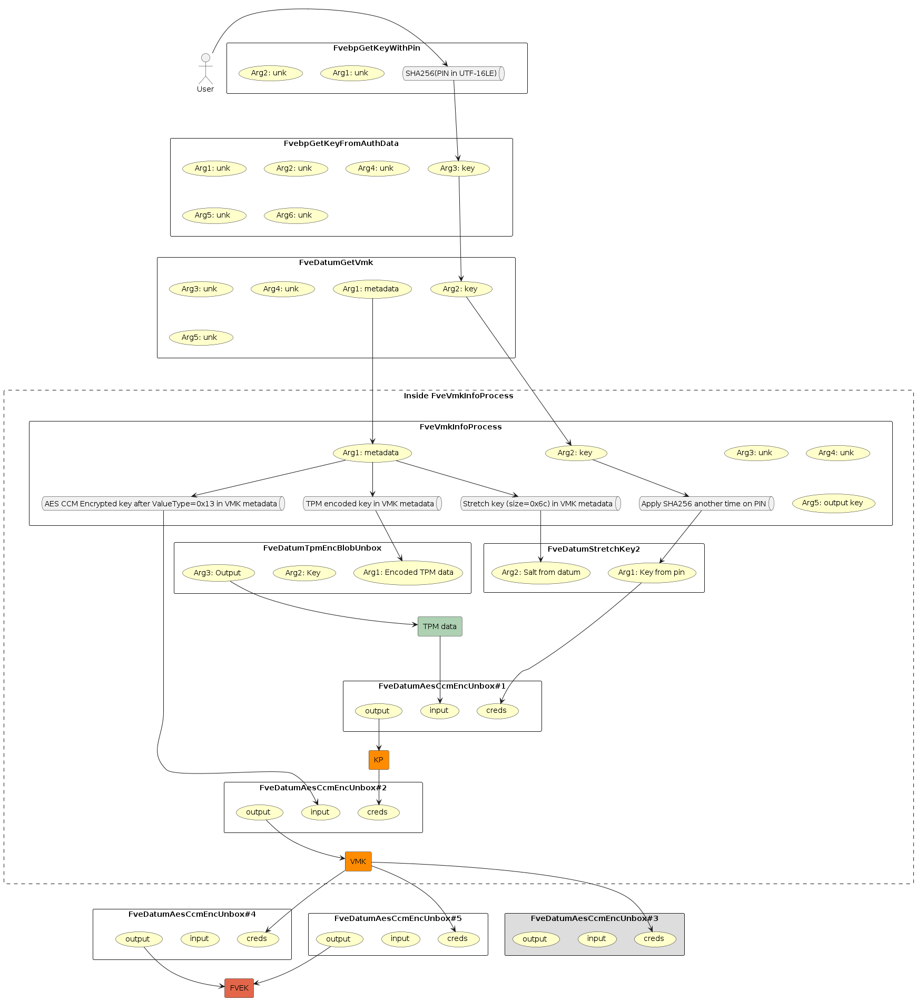
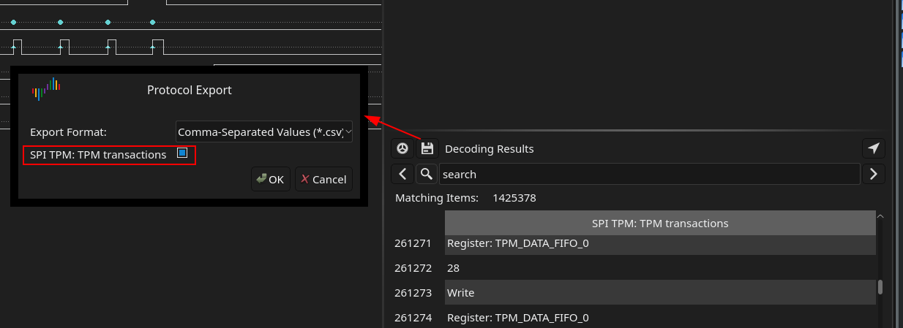
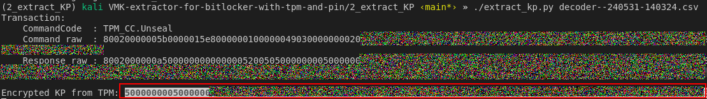
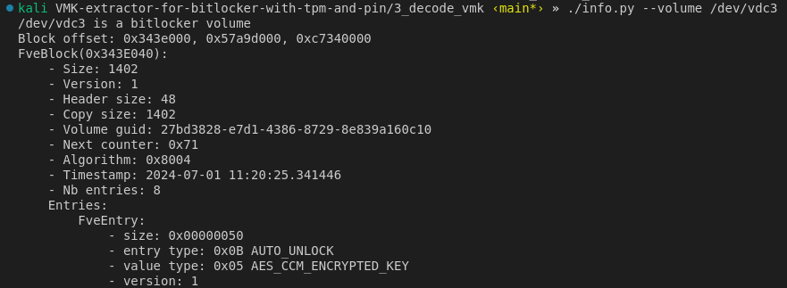
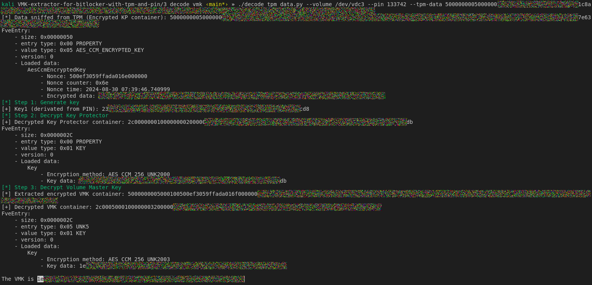

# VMK extractor for bitlocker with tpm and pin

**Article**: https://post-cyberlabs.github.io/Offensive-security-publications/posts/2024_09_tpmandpin/

# Overview

Technic to extract VMK from bitlocker volume that are protected by TPM are already documented in different publication.

The purpose of this GitHub repo is giving toolset to extract VMK in the case of **TPMAndPIN** that is different from **TPM** only case

The usage of **TPMAndPIN** protector rely on TPM to release the encrypted *Key Protector*(aka *KP*) and the PIN code to decrypt *KP*.
Then using the *KP*, the *VMK* can be decrypted and the BitLocker volume can be mount.



One practical use of this tool is the Local Privilege Escalation as a valid PIN code is required.

# Requirement

* Laptop/desktop volume protected by BitLocker using TPMAndPin protector
* TPM configured to use the motherboard TPM (dTPM)
* Knownledge of PIN code
* TPM capture done with [DSview](https://github.com/DreamSourceLab/DSView) a fork of [PulseView](https://sigrok.org/wiki/PulseView) to be compatible with DreamSource logic analyzer. Not tested on PulseView.

# Usage

## Global Steps

1. Capture dTPM traffic
2. Extract encrypted KP from sniffed TPM data
3. Decrypt KP and decode VMK using pin code and decrypted KP

### 1 - Capture TPM traffic

1. Connect logic analyzer probes to motherboard TPM.
The TPM pinout can be found in its datasheet
2. Configure decode the two decode:
    * SPI
    * TPM SPI transaction
3. Capture TPM traffic at boot time
4. Export the collected data in CSV format with only the column *SPI TPM: TPM transactions*



### 2 - Extract encrypted KP from sniffed TPM data

1. Install script dependancy
    * **click**
    * **tpmstream**
```bash
git submodule update --init
pipenv --site-packages install
```

2. Use the script `extract_kp.py` to extract encrypted KP from CSV data:

``` ./extract_kp.py decoder--240531-140324.csv```




### 3 - Decrypt KP and decode VMK using pin code and decrypted KP

1. Install script dependancy
    * **click**
    * **pycryptodome**

```bash
pipenv --site-packages install
```

1. Mount the target disk on another machine with linux as OS (Debian, Kali, etc.)
2. Locate the BitLocker partition (during our test, the partition is the third one). A way to determine, if the partition is a BitLocker volume, is using the script `info.py` available in folder `3_decode_vmk`. This script permits to list the BitLocker metadata.



3. With the extracted TPM data and the PIN code, use the script `decode_tpm_data.py` in the folder `3_decode_vmk`.


